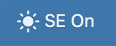
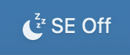
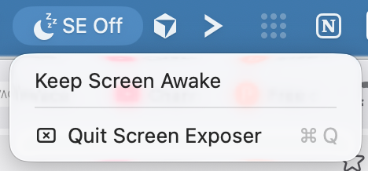

# Screen Anti-Saver

Small macOS menu bar app that keeps the display awake.

Build it:

```sh
./build.sh
```

Run it:

```sh
open .build/screen-antisaver.app
```

## Images:

On:



Off:



Dropdown:


